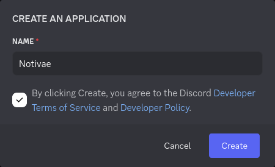
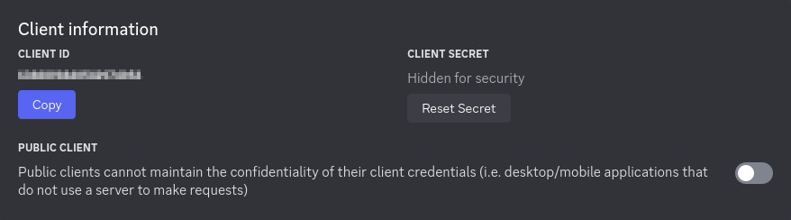
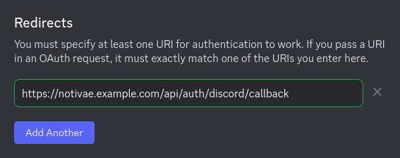

# Authentication via Discord

This guide explains how to set up authentication via Discord for your application.

## Prerequisites

1. A valid Discord account.
2. Access to the [Discord Developer Portal](https://discord.com/developers/applications/).
3. Your application's domain or URL where the authentication system will be integrated.

## Environment Variables

```dotenv
DISCORD_CLIENT_ID=
DISCORD_CLIENT_SECRET=
```

| Variable                | Description                      |
|-------------------------|----------------------------------|
| `DISCORD_CLIENT_ID`     | Your application's Client ID     |
| `DISCORD_CLIENT_SECRET` | Your application's Client Secret |

::: details Hidden Variables

```dotenv
DISCORD_DISCOVERY_URI=https://discord.com/.well-known/openid-configuration
DISCORD_SCOPES="openid profile email"
```

:::

## Setup Instructions

### Step 1: Register an application

1. Head over to the [Discord Developer Portal](https://discord.com/developers/applications/)
2. Click on **New application**
3. Provide a name for your application and agree to the terms of service



### Step 2: Retrieve OAuth credentials

1. In the sidebar under **Settings** click on **OAuth2**
2. Locate the following credentials:
   - **Client ID**: Copy this value 
   - **Client Secret**: Click on "Reset secret", confirm, and copy the generated value 



### Step 3: Configure Redirect URLs

1. Scroll to the **Redirect** section under **OAuth2**
2. Click **Add Redirect** and provide your callback URL in the following format: \
   `https://<YOUR DOMAIN>/api/auth/discord/callback` \
   Replace `<YOUR_DOMAIN>` with your application's actual domain name.


